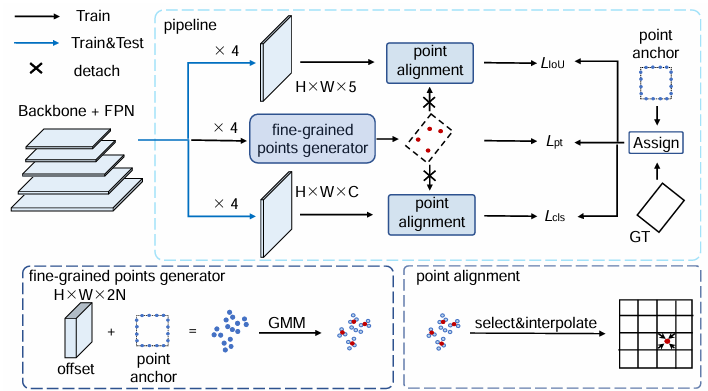

## PARDet: Dynamic Point Set Alignment for Rotated Object Detection



## Benchmark and model zoo

|    Model    | Backbone |  MS  | Rotate | Lr schd |                           Download                           |
| :---------: | :------: | :--: | :----: | :-----: | :----------------------------------------------------------: |
|   PARDet    | R-50-FPN |  -   |   -    |   1x    | [BaiduNetDisk](https://pan.baidu.com/s/1UhMJJIRM5KkHtzLfJLo_nQ?pwd=5xn6)[5xn6] |
| PARDet_ATSS | R-50-FPN |  -   |   -    |   1x    | [BaiduNetDisk](https://pan.baidu.com/s/137E32a0nOidwwdZpmx_PsQ?pwd=p4os)[p4os] |

## Installation

create virtual environment

```
conda create -n pardet python=3.8 -y
conda activate pardet
```

install pytorch

```
pip3 install torch==1.7.0+cu101 torchvision==0.8.1+cu101 -f https://download.pytorch.org/whl/torch_stable.html
```

manually install mmdetection/mmcv

```
pip install mmcv-full==1.2.5 -f https://download.openmmlab.com/mmcv/dist/cu101/torch1.7.0/index.html
```

```
cd pardet
pip install -r requirements/build.txt
pip install -v -e . # or "python setup.py develop"
```

Install DOTA_devkit

```
cd DOTA_devkit
sudo apt-get install swig
swig -c++ -python polyiou.i
python setup.py build_ext --inplace
```

## Train

~~~
CUDA_VISIBLE_DEVICES=1 python tools/train.py configs/PARDet/pardet_r50_fpn_1x.py 
~~~

## Test

~~~
CUDA_VISIBLE_DEVICES=1 python tools/test.py {configs} {ckpt_path} --out {pkl_path}
~~~

etc.

~~~
CUDA_VISIBLE_DEVICES=1 python tools/test.py configs/PARDet/pardet_r50_fpn_1x.py /data/Aerial/checkpoints/paper/pardet/sift_point_num20_con_4/epoch_12.pth --out /data/Aerial/checkpoints/paper/pardet/sift_point_num20_con_4/results.pkl
~~~


## Parse result

```
python tools/rotate/parse_results.py {configs} {pkl_path} 
						    -[nms]
                              --[type]
                              --[eval]
```

* configs:the model config you design
* pkl:model inference result
* nms:whether to merge result [Y/N]
* type:if you want to merge, merge rotate or horizon [HBB/OBB/ALL]
* eval: whether to eval result

etc.

~~~
python tools/rotate/parse_results.py configs/PARDet/pardet_r50_fpn_1x.py /data/Aerial/checkpoints/paper/pardet/sift_point_num20_con_4/results.pkl Y --eval=N  
~~~

## Citation

~~~
@article{xu2024pardet,
  title={PARDet: Dynamic point set alignment for rotated object detection},
  author={Xu, Yihao and Shen, Jifeng and Dai, Ming and Yang, Wankou},
  journal={Pattern Recognition},
  pages={110534},
  year={2024},
  publisher={Elsevier}
}
~~~

